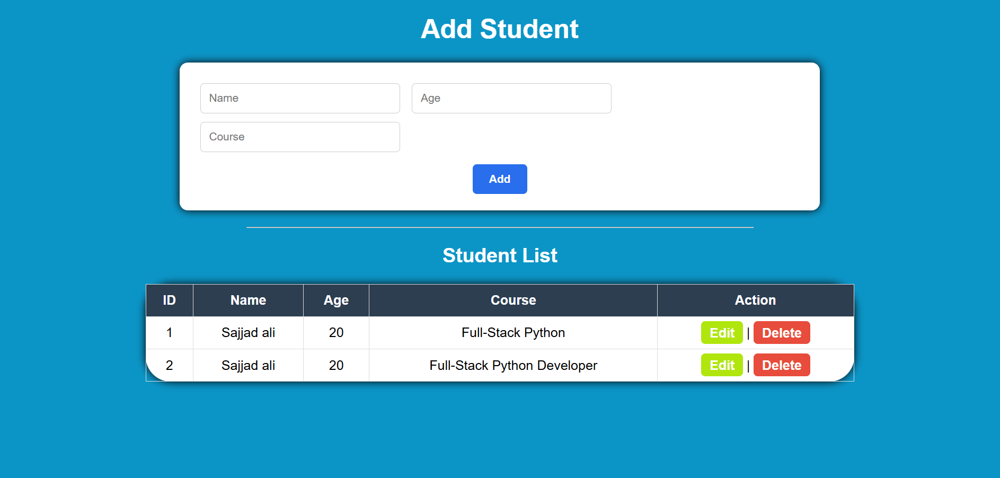
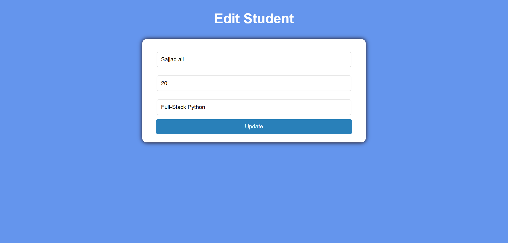

# Student Management System (Flask)

##  Description
A simple web app built using Flask and SQLite to manage students.

##  Features
- Add Student
- Edit Student
- Delete Student
- View Student List

## 🛠️ Tech Stack
- Flask
- SQLite
- HTML
- CSS

## 🖼️ Project Screenshots

### Student Management System Dashboard


### ✏️ Edit Student Page


---

## 🤝 Connect with Me

Agar aapke paas koi sawal hai ya aap connect karna chahte hain, toh aap mujhe niche diye gaye platforms par reach out kar sakte hain: <br>
<i>If you have any questions or would like to connect, feel free to reach out to me on the platforms below:"</i>

* **LinkedIn:**  
  <a href="https://www.linkedin.com/in/sajjadali-fullstack/" target="_blank">
    
  </a>

* **Gmail:**  
  <a href="mailto:sajjadali.dev01@gmail.com">
    
  </a>

---

## 💖 Support & Usage
If you find this project helpful or plan to use it as a template for your learning, please consider:
1. Giving it a **Star ⭐**
2. Giving credit to the original author means me Your Sajju 🔥✨

---
## ▶️ Run Project
```bash
python app.py
